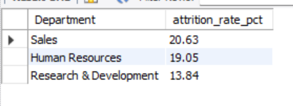
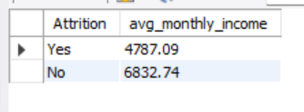
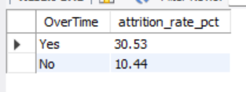
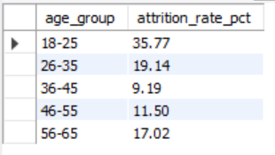
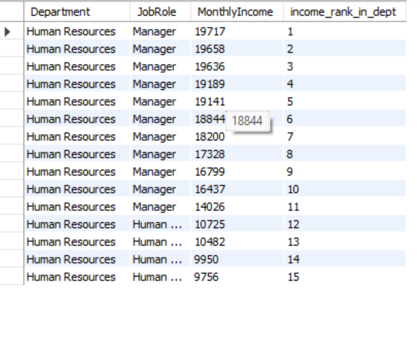

# HR Analytics — Employee Attrition Analysis (SQL)

Analyzed 1,470 employee records in MySQL to answer 4 business questions plus 
one advanced query, using GROUP BY, CASE WHEN, CTEs, subqueries, and window functions.

## Q1: Which departments have the highest attrition?

Sales (20.63%) and HR (19.05%) have the highest attrition; R&D (13.84%) is most stable.

## Q2: Does salary affect attrition?

Employees who left earned $4,787/month on average vs $6,833/month for those who stayed — a ~30% gap.

## Q3: Does overtime increase turnover?

Overtime workers had a 30.53% attrition rate vs 10.44% without overtime — nearly 3x higher.

## Q4: Which age groups leave most often?

18-25 has the highest attrition (35.77%), dropping sharply with age before ticking up again at 56-65 (likely retirement).

## Bonus: Income ranking within department (window function)

Used `RANK() OVER (PARTITION BY Department ORDER BY MonthlyIncome DESC)` to 
rank employees by income within their own department.

